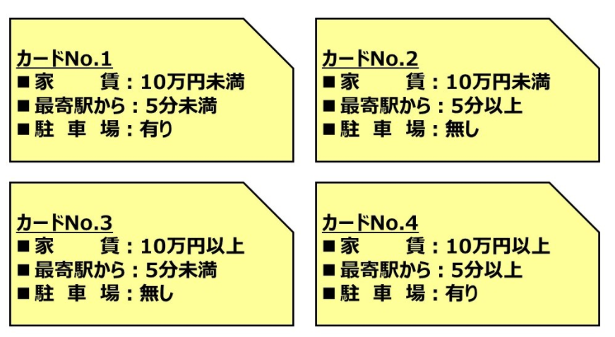
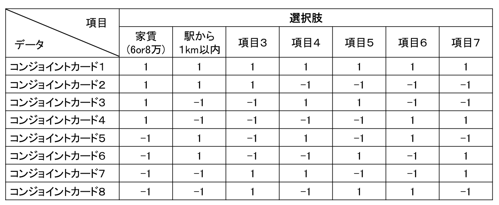
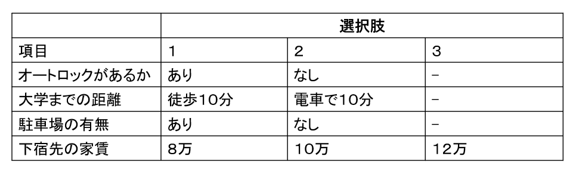
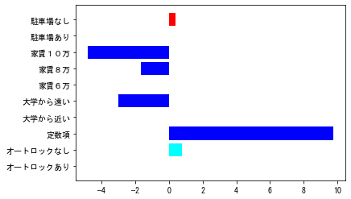

#### **この記事は[こちらのブログの記事](https://kentapt.hatenablog.com/entry/2022/01/03/141924?_ga=2.15025779.494030156.1641034049-1601353361.1630730568)のために作られたものです**  

<br>  

# コンジョイント分析を用いて、消費者の好みを分析してみよう  
# はじめに

コンジョイント分析と呼ばれる手法や、pythonによるコーディングについて勉強したため、ここに自分用のまとめとして残したいと思います。間違いなどがあれば教えていただけますと幸いです。参考にさせていただいた記事は末尾にも、掲載しています。  

　コンジョイント分析とは、いくつかの製品属性を組み合わせた複数の代替案を回答者に提示し、好ましさをランク付けしてもらい、回答者の選好を分析する手法です。コンジョイント分析を用いることで、製品の価格や色、デザイン、品質などの要因が、それぞれどのくらい選好に影響を与えているかを調べることができます（グロービス経営大学院の記事より引用）。  

  

コンジョイント分析の基本的な内容は、以下の書籍がわかりやすかったです。  

https://www.amazon.co.jp/%E4%BE%8B%E9%A1%8C%E3%81%A8Excel%E6%BC%94%E7%BF%92%E3%81%A7%E5%AD%A6%E3%81%B6%E5%A4%9A%E5%A4%89%E9%87%8F%E8%A7%A3%E6%9E%90-%E5%9B%9E%E5%B8%B0%E5%88%86%E6%9E%90%E3%83%BB%E5%88%A4%E5%88%A5%E5%88%86%E6%9E%90%E3%83%BB%E3%82%B3%E3%83%B3%E3%82%B8%E3%83%A7%E3%82%A4%E3%83%B3%E3%83%88%E5%88%86%E6%9E%90-%E7%B7%A8-%E8%8F%85%E6%B0%91%E9%83%8E-ebook/dp/B071CGDBX7  

  

また、閲覧可能な記事としては以下の、マーケティングリサーチの学び場『Lactivator』さまの記事がわかりやすかったです。  

https://lactivator.net/2020/11/12/conjoint_analysis/  

  

この記事では、pythonコードも記述しており、コンジョイント分析をより包括的に知りたい場合は、他の参考サイトや上の書籍を見ていただけると幸いです。

  
# 想定する状況

ここでは、不動産会社になったつもりで、より多くの大学生に対して満足のいく下宿先を提供したいとします。そのためには、新入生や自宅から通う**大学生がどのような下宿先の条件に注目しているか知る**必要があります（ここではわかりやすい例としてあげていて、実際に私はそういう経験がないのでわかりません。あくまで例としてご理解ください）。

　下宿先の家の条件として、家賃やセキュリティー、学校までの距離、築年数などがあるでしょう。万人には当てはまらないにしても、ペットを飼ってもいいか、というのも重要な学生も一定数存在しそうです。ただ、それらが、どれくらい学生にとって重視されているか、よくわかりません、下宿先でペットを飼いたい人がどれくらいいるのかもわからないので調査してみたくなったとします。

それらの条件（例：家賃や築年数）の重要度を調べるためには以下の方法が考えられます：

**考えられる条件をすべて書いて、たくさんの学生に順位付けしてもらう**

  

ただ、この調査にはいくつか問題があります。例えば、

   1.  たくさんありすぎて回答する自分でもよくわからなくなる 
   1.  単純にめんどくさくなって適当になっちゃう 
   1.  １番目と５番目に重視する内容が具体的にどれくらいの重要度の差があるのかわからない 
   1.  その順位を集めた結果があっても、ある条件をもった家（家賃が安くて、少し古くて、大学から少し遠くて、、、）がどれくらい魅力的なのかわからない 

といった問題が考えられます。そこで**コンジョイント分析**では、**コンジョイントカード**というカードを用意して、それに対してスコア（魅力度）をつけるなどして、消費者（ここでは学生）の好みやトレンドを分析します。

# コンジョイントカード

　以下にコンジョイントカードとそれを使った調査の例を示します。実験対象者はこのようなカードを見せられて、具体的にその魅力度のスコアを付けてもらいます。その場合、実際に家を選ぶ時の条件に似ていますね。また、家賃などの条件の羅列をみて順位付けするよりも正確なフィードバックが得られそうです。

　また、**コンジョイントカードを用いるメリットとして、実際の質問の総パターンよりも少ない枚数のカードで済みます**。例えば2択の質問が６つあるだけでもそれらを全て網羅しようとすると、**２の６乗で６４枚ものカードのスコアを付けるのはとても大変**です。



**画像出典：マーケティングリサーチの学び場『Lactivator』：**

[購入決定を左右する商品要素を知る～コンジョイント分析の流れを徹底解説～](https://lactivator.net/2020/11/12/conjoint_analysis/)

# 直交表について

コンジョイント分析では、あり得るコンジョイントカードを漏れなく、被験者に答えてもらうのではなく（大変な作業なので全パターンを聞くのは避けたい）、それよりもっと少ない（例：全８枚の内、４枚だけでよい）数で済むことがポイントでした。

## 直交表の例

下の表は、コンジョイントカードの質問の例です。2択の項目（質問）が７つあり、それに対して８枚のコンジョイントカードを用意します。このような表を直交表といいます。例えば、家賃が６万か８万の２択だったとすると、１の場合は６万、-１の場合は８万、といったふうに対応づけられていて、これによってコンジョイントカードの内容がわかります。



## 直交表のルール

総当たりで質問すると膨大な量になっていたものが、少数になると非常に嬉しいですね。さきほどの直交表をみてコンジョイントカードのパターンが決定されますが、感覚的には、**同じ条件ばかりにならず、かつ他の項目との出現のパターンも毎回異なっていると少ないカード数で済みそう**です。逆に、いつも家賃の値が８万で、さらにいつも８万＆駅チカの物件ばかり聞かれても、カードのパターンが重複している気がしますね。このように、それっぽく適当に直交表が作られるのではなく、決まりがあります。

**1 . 各項目（縦の方向）の和が０であること**

**2 . 各項目（縦の列）に関して、任意の２列の単相関係数は必ず０になる**

ということです。

1に関しては、各項目で見たときに、例えば家賃８万のコンジョイントカードばかりだと、カードのパターンが偏っていて、６万のほうの影響が計算できないことが想像できます。**各項目の出現確率は同じ、つまり縦方向で足し算をすると０になるべき**なのは納得がいきますね。

2に関しては、単相関係数が０、ということであれば、単に各列の共分散が０になることを確認できればOKです。違う言い方をすると各列の内積が０であればOKです。共分散が０（相関係数が０）であるということは、**各列は全く相関がない、似ていない、ということ**になりますね。逆に、各列が似ている場合を考えてみましょう。コンジョイントカードを眺めてみて、家賃６万＆駅から近い、という条件のカードばかりだと、似通った質問しかできていない気がしますね。そして、相関が０であれば、毎回全然ちがうパターンの例（ここでは下宿先の物件）を被験者に提示できているので、それであれば少ない枚数で、効果的に総当たり方式での質問をしたときのような成果が得られそうですね。

# データについて

上のgithubのページのdataというフォルダ内に、data.csvという練習用のデータを格納しています。適当にL8 2^4×3型を作成してみました。  直交表にもいろいろなパターンやそれに伴うパターン名がありますが、ひとまずここでは割愛させていただきます。- のマークは単に選択肢がないという意味です（２択）。



下宿先の部屋の候補を想定して、オートロックがあるか、大学までの距離、駐車場の有無、下宿先の家賃をもとに、そこに住みたいかのスコアを付けます。以降のセクションでは、実際に私が練習用に作った回答（二人分）をもとに、コンジョイント分析を行っていきたいと思います。  

# コンジョイント分析を用いて、消費者の好みを分析してみよう  

以下は、コンジョイント分析を行うためのpythonコードです。
- pythonのバージョンは3.8  
- 他のモジュールのバージョンについては、githubにアップロードしているファイルをダウンロードして、`myenv.txt` をご確認ください。

## モジュールのインポート


```python
import pandas as pd
import numpy as np
import matplotlib.pyplot as plt
import seaborn as sns
import statsmodels.api as sm
```

## データの読み込み


```python
df = pd.read_csv('./data/data.csv')
# x, y の指定
y = pd.DataFrame(df['score'])
x = df.drop(columns=['score'])
x.head(20)
```


<div>
<style scoped>
    .dataframe tbody tr th:only-of-type {
        vertical-align: middle;
    }

    .dataframe tbody tr th {
        vertical-align: top;
    }

    .dataframe thead th {
        text-align: right;
    }
</style>
<table border="1" class="dataframe">
  <thead>
    <tr style="text-align: right;">
      <th></th>
      <th>auto-lock</th>
      <th>distToUniv</th>
      <th>isParking</th>
      <th>fee</th>
    </tr>
  </thead>
  <tbody>
    <tr>
      <th>0</th>
      <td>1</td>
      <td>1</td>
      <td>1</td>
      <td>2</td>
    </tr>
    <tr>
      <th>1</th>
      <td>1</td>
      <td>1</td>
      <td>2</td>
      <td>1</td>
    </tr>
    <tr>
      <th>2</th>
      <td>1</td>
      <td>2</td>
      <td>1</td>
      <td>1</td>
    </tr>
    <tr>
      <th>3</th>
      <td>1</td>
      <td>2</td>
      <td>2</td>
      <td>3</td>
    </tr>
    <tr>
      <th>4</th>
      <td>2</td>
      <td>2</td>
      <td>2</td>
      <td>2</td>
    </tr>
    <tr>
      <th>5</th>
      <td>2</td>
      <td>2</td>
      <td>1</td>
      <td>1</td>
    </tr>
    <tr>
      <th>6</th>
      <td>2</td>
      <td>1</td>
      <td>2</td>
      <td>1</td>
    </tr>
    <tr>
      <th>7</th>
      <td>2</td>
      <td>1</td>
      <td>1</td>
      <td>3</td>
    </tr>
    <tr>
      <th>8</th>
      <td>1</td>
      <td>1</td>
      <td>1</td>
      <td>2</td>
    </tr>
    <tr>
      <th>9</th>
      <td>1</td>
      <td>1</td>
      <td>2</td>
      <td>1</td>
    </tr>
    <tr>
      <th>10</th>
      <td>1</td>
      <td>2</td>
      <td>1</td>
      <td>1</td>
    </tr>
    <tr>
      <th>11</th>
      <td>1</td>
      <td>2</td>
      <td>2</td>
      <td>3</td>
    </tr>
    <tr>
      <th>12</th>
      <td>2</td>
      <td>2</td>
      <td>2</td>
      <td>2</td>
    </tr>
    <tr>
      <th>13</th>
      <td>2</td>
      <td>2</td>
      <td>1</td>
      <td>1</td>
    </tr>
    <tr>
      <th>14</th>
      <td>2</td>
      <td>1</td>
      <td>2</td>
      <td>1</td>
    </tr>
    <tr>
      <th>15</th>
      <td>2</td>
      <td>1</td>
      <td>1</td>
      <td>3</td>
    </tr>
  </tbody>
</table>
</div>


このデータは２人分、合計１６個の回答を示しています。例えば一番上の`auto-lock 1, distToUniv 1, isParking 1, fee 2`では、  
オートロックあり、大学からの距離がちかい、駐車場あり、家賃８万（１～３があって、それぞれ、６，８，１０万に対応）という条件を示しています。これに対して、それぞれ被験者（今回は私が勝手に回答）が魅力度のスコアを付けます。

## ダミー変数への変換  
ここでは、`pd.get_dummies`関数を用いて、そのカードに、該当の項目が書かれているかどうかを 0/1で示します。 
one-hotベクトルに直しているのと似ています。  
`drop_first`をtrueにして、その項目のはじめの要素は削除するようにしています。例えば、駐車場の有無では、駐車場がある、という要素が0である場合と、駐車場がない、という要素が1である場合は同じ意味です。


```python
x_dum = pd.get_dummies(x, columns=x.columns, drop_first=True)
x_dum.head()
```


<div>
<style scoped>
    .dataframe tbody tr th:only-of-type {
        vertical-align: middle;
    }

    .dataframe tbody tr th {
        vertical-align: top;
    }

    .dataframe thead th {
        text-align: right;
    }
</style>
<table border="1" class="dataframe">
  <thead>
    <tr style="text-align: right;">
      <th></th>
      <th>auto-lock_2</th>
      <th>distToUniv_2</th>
      <th>isParking_2</th>
      <th>fee_2</th>
      <th>fee_3</th>
    </tr>
  </thead>
  <tbody>
    <tr>
      <th>0</th>
      <td>0</td>
      <td>0</td>
      <td>0</td>
      <td>1</td>
      <td>0</td>
    </tr>
    <tr>
      <th>1</th>
      <td>0</td>
      <td>0</td>
      <td>1</td>
      <td>0</td>
      <td>0</td>
    </tr>
    <tr>
      <th>2</th>
      <td>0</td>
      <td>1</td>
      <td>0</td>
      <td>0</td>
      <td>0</td>
    </tr>
    <tr>
      <th>3</th>
      <td>0</td>
      <td>1</td>
      <td>1</td>
      <td>0</td>
      <td>1</td>
    </tr>
    <tr>
      <th>4</th>
      <td>1</td>
      <td>1</td>
      <td>1</td>
      <td>1</td>
      <td>0</td>
    </tr>
  </tbody>
</table>
</div>


```python
# drop_firstを無効にした場合を確認。_1のものが残っていることがわかる。ここではこのデータは使わない
x_dum_noDrop = pd.get_dummies(x, columns=x.columns, drop_first=False)
x_dum_noDrop.head()
```


<div>
<style scoped>
    .dataframe tbody tr th:only-of-type {
        vertical-align: middle;
    }

    .dataframe tbody tr th {
        vertical-align: top;
    }

    .dataframe thead th {
        text-align: right;
    }
</style>
<table border="1" class="dataframe">
  <thead>
    <tr style="text-align: right;">
      <th></th>
      <th>auto-lock_1</th>
      <th>auto-lock_2</th>
      <th>distToUniv_1</th>
      <th>distToUniv_2</th>
      <th>isParking_1</th>
      <th>isParking_2</th>
      <th>fee_1</th>
      <th>fee_2</th>
      <th>fee_3</th>
    </tr>
  </thead>
  <tbody>
    <tr>
      <th>0</th>
      <td>1</td>
      <td>0</td>
      <td>1</td>
      <td>0</td>
      <td>1</td>
      <td>0</td>
      <td>0</td>
      <td>1</td>
      <td>0</td>
    </tr>
    <tr>
      <th>1</th>
      <td>1</td>
      <td>0</td>
      <td>1</td>
      <td>0</td>
      <td>0</td>
      <td>1</td>
      <td>1</td>
      <td>0</td>
      <td>0</td>
    </tr>
    <tr>
      <th>2</th>
      <td>1</td>
      <td>0</td>
      <td>0</td>
      <td>1</td>
      <td>1</td>
      <td>0</td>
      <td>1</td>
      <td>0</td>
      <td>0</td>
    </tr>
    <tr>
      <th>3</th>
      <td>1</td>
      <td>0</td>
      <td>0</td>
      <td>1</td>
      <td>0</td>
      <td>1</td>
      <td>0</td>
      <td>0</td>
      <td>1</td>
    </tr>
    <tr>
      <th>4</th>
      <td>0</td>
      <td>1</td>
      <td>0</td>
      <td>1</td>
      <td>0</td>
      <td>1</td>
      <td>0</td>
      <td>1</td>
      <td>0</td>
    </tr>
  </tbody>
</table>
</div>


```python
df.describe() #要素の平均や標準偏差などの基本的な統計データを表示させる
```


<div>
<style scoped>
    .dataframe tbody tr th:only-of-type {
        vertical-align: middle;
    }

    .dataframe tbody tr th {
        vertical-align: top;
    }

    .dataframe thead th {
        text-align: right;
    }
</style>
<table border="1" class="dataframe">
  <thead>
    <tr style="text-align: right;">
      <th></th>
      <th>score</th>
      <th>auto-lock</th>
      <th>distToUniv</th>
      <th>isParking</th>
      <th>fee</th>
    </tr>
  </thead>
  <tbody>
    <tr>
      <th>count</th>
      <td>16.000000</td>
      <td>16.000000</td>
      <td>16.000000</td>
      <td>16.000000</td>
      <td>16.000000</td>
    </tr>
    <tr>
      <th>mean</th>
      <td>7.187500</td>
      <td>1.500000</td>
      <td>1.500000</td>
      <td>1.500000</td>
      <td>1.750000</td>
    </tr>
    <tr>
      <th>std</th>
      <td>2.644964</td>
      <td>0.516398</td>
      <td>0.516398</td>
      <td>0.516398</td>
      <td>0.856349</td>
    </tr>
    <tr>
      <th>min</th>
      <td>2.000000</td>
      <td>1.000000</td>
      <td>1.000000</td>
      <td>1.000000</td>
      <td>1.000000</td>
    </tr>
    <tr>
      <th>25%</th>
      <td>6.000000</td>
      <td>1.000000</td>
      <td>1.000000</td>
      <td>1.000000</td>
      <td>1.000000</td>
    </tr>
    <tr>
      <th>50%</th>
      <td>7.000000</td>
      <td>1.500000</td>
      <td>1.500000</td>
      <td>1.500000</td>
      <td>1.500000</td>
    </tr>
    <tr>
      <th>75%</th>
      <td>8.625000</td>
      <td>2.000000</td>
      <td>2.000000</td>
      <td>2.000000</td>
      <td>2.250000</td>
    </tr>
    <tr>
      <th>max</th>
      <td>12.000000</td>
      <td>2.000000</td>
      <td>2.000000</td>
      <td>2.000000</td>
      <td>3.000000</td>
    </tr>
  </tbody>
</table>
</div>


## 切片を追加 
また、コンジョイントカードに記載されている内容に加えて、その他の影響がある場合に備えて、定数項も加えます。

この操作によってフィッティングするときの切片を計算することができます。  
https://www.statsmodels.org/stable/generated/statsmodels.tools.tools.add_constant.html


```python
x_dum=sm.add_constant(x_dum) # constという要素を追加
x_dum.head(10) # constが追加されたことを確認
```

      x = pd.concat(x[::order], 1)
    


<div>
<style scoped>
    .dataframe tbody tr th:only-of-type {
        vertical-align: middle;
    }

    .dataframe tbody tr th {
        vertical-align: top;
    }

    .dataframe thead th {
        text-align: right;
    }
</style>
<table border="1" class="dataframe">
  <thead>
    <tr style="text-align: right;">
      <th></th>
      <th>const</th>
      <th>auto-lock_2</th>
      <th>distToUniv_2</th>
      <th>isParking_2</th>
      <th>fee_2</th>
      <th>fee_3</th>
    </tr>
  </thead>
  <tbody>
    <tr>
      <th>0</th>
      <td>1.0</td>
      <td>0</td>
      <td>0</td>
      <td>0</td>
      <td>1</td>
      <td>0</td>
    </tr>
    <tr>
      <th>1</th>
      <td>1.0</td>
      <td>0</td>
      <td>0</td>
      <td>1</td>
      <td>0</td>
      <td>0</td>
    </tr>
    <tr>
      <th>2</th>
      <td>1.0</td>
      <td>0</td>
      <td>1</td>
      <td>0</td>
      <td>0</td>
      <td>0</td>
    </tr>
    <tr>
      <th>3</th>
      <td>1.0</td>
      <td>0</td>
      <td>1</td>
      <td>1</td>
      <td>0</td>
      <td>1</td>
    </tr>
    <tr>
      <th>4</th>
      <td>1.0</td>
      <td>1</td>
      <td>1</td>
      <td>1</td>
      <td>1</td>
      <td>0</td>
    </tr>
    <tr>
      <th>5</th>
      <td>1.0</td>
      <td>1</td>
      <td>1</td>
      <td>0</td>
      <td>0</td>
      <td>0</td>
    </tr>
    <tr>
      <th>6</th>
      <td>1.0</td>
      <td>1</td>
      <td>0</td>
      <td>1</td>
      <td>0</td>
      <td>0</td>
    </tr>
    <tr>
      <th>7</th>
      <td>1.0</td>
      <td>1</td>
      <td>0</td>
      <td>0</td>
      <td>0</td>
      <td>1</td>
    </tr>
    <tr>
      <th>8</th>
      <td>1.0</td>
      <td>0</td>
      <td>0</td>
      <td>0</td>
      <td>1</td>
      <td>0</td>
    </tr>
    <tr>
      <th>9</th>
      <td>1.0</td>
      <td>0</td>
      <td>0</td>
      <td>1</td>
      <td>0</td>
      <td>0</td>
    </tr>
  </tbody>
</table>
</div>


## OLS (Ordinary Least Squares) でフィッティング


```python
model = sm.OLS(y, x_dum)
# フィッティングを実行
result = model.fit()
# 結果の一覧を表示
result.summary()
```

    C:\Users\itaku\anaconda3\envs\py38_geopanda\lib\site-packages\scipy\stats\stats.py:1541: UserWarning: kurtosistest only valid for n>=20 ... continuing anyway, n=16
      warnings.warn("kurtosistest only valid for n>=20 ... continuing "
    


<table class="simpletable">
<caption>OLS Regression Results</caption>
<tr>
  <th>Dep. Variable:</th>          <td>score</td>      <th>  R-squared:         </th> <td>   0.959</td>
</tr>
<tr>
  <th>Model:</th>                   <td>OLS</td>       <th>  Adj. R-squared:    </th> <td>   0.938</td>
</tr>
<tr>
  <th>Method:</th>             <td>Least Squares</td>  <th>  F-statistic:       </th> <td>   46.32</td>
</tr>
<tr>
  <th>Date:</th>             <td>Mon, 03 Jan 2022</td> <th>  Prob (F-statistic):</th> <td>1.35e-06</td>
</tr>
<tr>
  <th>Time:</th>                 <td>13:46:07</td>     <th>  Log-Likelihood:    </th> <td> -12.272</td>
</tr>
<tr>
  <th>No. Observations:</th>      <td>    16</td>      <th>  AIC:               </th> <td>   36.54</td>
</tr>
<tr>
  <th>Df Residuals:</th>          <td>    10</td>      <th>  BIC:               </th> <td>   41.18</td>
</tr>
<tr>
  <th>Df Model:</th>              <td>     5</td>      <th>                     </th>     <td> </td>   
</tr>
<tr>
  <th>Covariance Type:</th>      <td>nonrobust</td>    <th>                     </th>     <td> </td>   
</tr>
</table>
<table class="simpletable">
<tr>
        <td></td>          <th>coef</th>     <th>std err</th>      <th>t</th>      <th>P>|t|</th>  <th>[0.025</th>    <th>0.975]</th>  
</tr>
<tr>
  <th>const</th>        <td>    9.7500</td> <td>    0.368</td> <td>   26.463</td> <td> 0.000</td> <td>    8.929</td> <td>   10.571</td>
</tr>
<tr>
  <th>auto-lock_2</th>  <td>    0.7500</td> <td>    0.330</td> <td>    2.276</td> <td> 0.046</td> <td>    0.016</td> <td>    1.484</td>
</tr>
<tr>
  <th>distToUniv_2</th> <td>   -3.0000</td> <td>    0.330</td> <td>   -9.104</td> <td> 0.000</td> <td>   -3.734</td> <td>   -2.266</td>
</tr>
<tr>
  <th>isParking_2</th>  <td>    0.3750</td> <td>    0.330</td> <td>    1.138</td> <td> 0.282</td> <td>   -0.359</td> <td>    1.109</td>
</tr>
<tr>
  <th>fee_2</th>        <td>   -1.6875</td> <td>    0.404</td> <td>   -4.181</td> <td> 0.002</td> <td>   -2.587</td> <td>   -0.788</td>
</tr>
<tr>
  <th>fee_3</th>        <td>   -4.8125</td> <td>    0.404</td> <td>  -11.924</td> <td> 0.000</td> <td>   -5.712</td> <td>   -3.913</td>
</tr>
</table>
<table class="simpletable">
<tr>
  <th>Omnibus:</th>       <td> 0.797</td> <th>  Durbin-Watson:     </th> <td>   2.795</td>
</tr>
<tr>
  <th>Prob(Omnibus):</th> <td> 0.671</td> <th>  Jarque-Bera (JB):  </th> <td>   0.028</td>
</tr>
<tr>
  <th>Skew:</th>          <td>-0.010</td> <th>  Prob(JB):          </th> <td>   0.986</td>
</tr>
<tr>
  <th>Kurtosis:</th>      <td> 3.205</td> <th>  Cond. No.          </th> <td>    4.54</td>
</tr>
</table><br/><br/>Notes:<br/>[1] Standard Errors assume that the covariance matrix of the errors is correctly specified.


## 結果の一部を取り出し  
`結果を見てみる`セクションで議論するため、weightとｐ値を取り出します


```python
df_result_selected = pd.DataFrame({
    'weight': result.params.values
    , 'p_val': result.pvalues
})
df_result_selected.head(10)
```


<div>
<style scoped>
    .dataframe tbody tr th:only-of-type {
        vertical-align: middle;
    }

    .dataframe tbody tr th {
        vertical-align: top;
    }

    .dataframe thead th {
        text-align: right;
    }
</style>
<table border="1" class="dataframe">
  <thead>
    <tr style="text-align: right;">
      <th></th>
      <th>weight</th>
      <th>p_val</th>
    </tr>
  </thead>
  <tbody>
    <tr>
      <th>const</th>
      <td>9.7500</td>
      <td>1.369002e-10</td>
    </tr>
    <tr>
      <th>auto-lock_2</th>
      <td>0.7500</td>
      <td>4.610362e-02</td>
    </tr>
    <tr>
      <th>distToUniv_2</th>
      <td>-3.0000</td>
      <td>3.732512e-06</td>
    </tr>
    <tr>
      <th>isParking_2</th>
      <td>0.3750</td>
      <td>2.816648e-01</td>
    </tr>
    <tr>
      <th>fee_2</th>
      <td>-1.6875</td>
      <td>1.884264e-03</td>
    </tr>
    <tr>
      <th>fee_3</th>
      <td>-4.8125</td>
      <td>3.101164e-07</td>
    </tr>
  </tbody>
</table>
</div>


## 可視化のための準備  
コンジョイント分析の結果を可視化するための準備を行います。上のdrop_Firstを有効にして、_ 1 がつく変数は落とされていました。グラフで表示させるため復帰させます。これらの重みは0とします。


```python
for s in df_result_selected.index:
    partitioned_string = s.partition('_')
    if partitioned_string[2] == "2":
        valBase = partitioned_string[0] + "_1"
        df_valBase = pd.DataFrame(data =np.zeros((1,2)),
                                  index = [valBase],
                                  columns = ["weight","p_val"])
        df_result_selected = pd.concat([df_result_selected,df_valBase])

df_result_selected.head(20) 
```


<div>
<style scoped>
    .dataframe tbody tr th:only-of-type {
        vertical-align: middle;
    }

    .dataframe tbody tr th {
        vertical-align: top;
    }

    .dataframe thead th {
        text-align: right;
    }
</style>
<table border="1" class="dataframe">
  <thead>
    <tr style="text-align: right;">
      <th></th>
      <th>weight</th>
      <th>p_val</th>
    </tr>
  </thead>
  <tbody>
    <tr>
      <th>const</th>
      <td>9.7500</td>
      <td>1.369002e-10</td>
    </tr>
    <tr>
      <th>auto-lock_2</th>
      <td>0.7500</td>
      <td>4.610362e-02</td>
    </tr>
    <tr>
      <th>distToUniv_2</th>
      <td>-3.0000</td>
      <td>3.732512e-06</td>
    </tr>
    <tr>
      <th>isParking_2</th>
      <td>0.3750</td>
      <td>2.816648e-01</td>
    </tr>
    <tr>
      <th>fee_2</th>
      <td>-1.6875</td>
      <td>1.884264e-03</td>
    </tr>
    <tr>
      <th>fee_3</th>
      <td>-4.8125</td>
      <td>3.101164e-07</td>
    </tr>
    <tr>
      <th>auto-lock_1</th>
      <td>0.0000</td>
      <td>0.000000e+00</td>
    </tr>
    <tr>
      <th>distToUniv_1</th>
      <td>0.0000</td>
      <td>0.000000e+00</td>
    </tr>
    <tr>
      <th>isParking_1</th>
      <td>0.0000</td>
      <td>0.000000e+00</td>
    </tr>
    <tr>
      <th>fee_1</th>
      <td>0.0000</td>
      <td>0.000000e+00</td>
    </tr>
  </tbody>
</table>
</div>


## ｐ値に応じてバーの色を変える：  
p値が0.01以上、0.05以下の場合はシアン、0.01以下の場合は青、0.05以上（あまり信用できない）の場合は赤に設定します。


```python
bar_col = []
for p_val in df_result_selected['p_val']:
    # print(p_val)
    if 0.01 < p_val < 0.05:
        bar_col.append('Cyan')
    elif p_val < 0.01:
        bar_col.append('blue')
    else:
        bar_col.append('red')

# p値が0.05以下のものを青、そうでないものを青とする
df_bar_col = pd.DataFrame(data = bar_col, 
                          columns=['bar_col'], 
                          index = df_result_selected.index)

df_result_selected = pd.concat([df_result_selected,df_bar_col], axis=1)
df_result_selected.head(20)
```


<div>
<style scoped>
    .dataframe tbody tr th:only-of-type {
        vertical-align: middle;
    }

    .dataframe tbody tr th {
        vertical-align: top;
    }

    .dataframe thead th {
        text-align: right;
    }
</style>
<table border="1" class="dataframe">
  <thead>
    <tr style="text-align: right;">
      <th></th>
      <th>weight</th>
      <th>p_val</th>
      <th>bar_col</th>
    </tr>
  </thead>
  <tbody>
    <tr>
      <th>const</th>
      <td>9.7500</td>
      <td>1.369002e-10</td>
      <td>blue</td>
    </tr>
    <tr>
      <th>auto-lock_2</th>
      <td>0.7500</td>
      <td>4.610362e-02</td>
      <td>Cyan</td>
    </tr>
    <tr>
      <th>distToUniv_2</th>
      <td>-3.0000</td>
      <td>3.732512e-06</td>
      <td>blue</td>
    </tr>
    <tr>
      <th>isParking_2</th>
      <td>0.3750</td>
      <td>2.816648e-01</td>
      <td>red</td>
    </tr>
    <tr>
      <th>fee_2</th>
      <td>-1.6875</td>
      <td>1.884264e-03</td>
      <td>blue</td>
    </tr>
    <tr>
      <th>fee_3</th>
      <td>-4.8125</td>
      <td>3.101164e-07</td>
      <td>blue</td>
    </tr>
    <tr>
      <th>auto-lock_1</th>
      <td>0.0000</td>
      <td>0.000000e+00</td>
      <td>blue</td>
    </tr>
    <tr>
      <th>distToUniv_1</th>
      <td>0.0000</td>
      <td>0.000000e+00</td>
      <td>blue</td>
    </tr>
    <tr>
      <th>isParking_1</th>
      <td>0.0000</td>
      <td>0.000000e+00</td>
      <td>blue</td>
    </tr>
    <tr>
      <th>fee_1</th>
      <td>0.0000</td>
      <td>0.000000e+00</td>
      <td>blue</td>
    </tr>
  </tbody>
</table>
</div>


## 部分効用値を表示させる  
_ 1 とつくものが基準になっているので、それをもとに同一カテゴリが正または負の影響があるか見てください。


```python
# プロットするときに日本語でも文字化けしないように設定
from matplotlib import rcParams
plt.rcParams["font.family"] = "MS Gothic"
# アルファベット順位
df_result_selected = df_result_selected.sort_index()
xbar = np.arange(len(df_result_selected['weight']))
plt.barh(xbar, df_result_selected['weight'], color=df_result_selected['bar_col'])
index_JP = ["駐車場なし","駐車場あり","家賃１０万","家賃８万","家賃６万","大学から遠い","大学から近い","定数項","オートロックなし","オートロックあり"]
plt.yticks(xbar, labels=index_JP[::-1]) # 順番があうように順番を逆にする
plt.show()
```


    

    


# 結果を見てみる  

## 上のOLS Regression Resultsについて（result.summary()で表示したところ）
- R-squaredは約0.96と高い値を示している
=> 良いフィッティング結果を得ることができた。簡単なデータではあったが、スコアを決定する要因の全体の9割以上を説明することができている。私の重視する家賃、大学までの近さがともに入っているためだと考えられる。ただ、これが私の家選びの傾向を完全に理解した、ということにはならないと思います（「考えたこと」章を参照ください）
- P>|t|	は、isParking_2以外、統計的に有意である（有意水準を5%とした場合）ことがわかります。
=> isParkingは個人的にどちらでも良いので、私がこの練習用データを作るときは、ほとんど見ずに回答していました。そのため、この限られたデータではうまくフィッティングできなかったのではないかと考えられます。もしより多くの似た考えをもつ回答者がいれば、このｐ値もより小さく（有意になり）、かつ重みが小さな値に収束していくはずです。P>|t|の欄の値が大きいものばかりだと、たまたま重みが大きくなっただけの偶然であることが否定できず、コンジョイント分析から多くの示唆を得ることができないため、今回はよい練習データになっていてよかったです。
- **多重共線性**について：Cond. No.(Condition number)を確認します。statsmodelsのドキュメンテーションによると、  

> One way to assess multicollinearity is to compute the condition number. Values over 20 are worrisome (see Greene 4.9).  

とあります。今回は20以下なので、多重共線性についてもひとまず大丈夫そうです。

https://www.statsmodels.org/stable/examples/notebooks/generated/ols.html

- 最後の色に分けられたグラフでは、**私が家賃安め＆大学から近め を優先してよいスコアを付けたので、納得のいくグラフ**です。駐車場がない場合が少しポジティブな方向に出ていますが、特に私は考えず記入していました。ここでは、ｐ値が0.05より高く赤で示されていて、特に考えず記入しなかったことともつじつまがあっています。

# 考えたこと  
この分析を勉強してみて考えたことを以下に記載します。この分析は勉強中なので的外れなところもあるかもしれませんのでご注意ください。
## コンジョイント分析全体について  
- 今回はpythonによる実装を中心に議論しましたが、解析の中身自体は重回帰をして、その重みをもって議論しているため、比較的シンプルな方法なのではないかと思いました。  
- 機械学習でいう、LIMEとアイデア似ているところが多いな思いました。LIMEでは、例えば画像の場合、ランダムにブラックアウトさせて、そのときのスコアの変動を見ます。そこでも線形回帰が使われていて、その重みを用いて機械学習や深層学習による判断根拠の可視化を行います。  

## 疑問点や改良点について  
- 今回は、被験者の少ないデータを自作し、テストしています。しかし、被験者が多くなった場合は、スコアのベースラインも被験者によって異なるのでその補正が必要だと思います。例えば、被験者によって、高めに点を付ける人、そうでない人が存在すると、各被験者のスコアの平均で割り算したり、何らかの標準化が必要です。  
- 重回帰による重要度の議論について：上で述べたLIMEでは、線形回帰をするために重回帰を用いたり、決定木を用いています。コンジョイント分析でも、うまく重回帰ではフィッティングできず、決定係数の低い場合は決定木を用いてみても良いのかもしれませんね。
- 今回の練習データでは決定係数も高く、P>|t|の値も良好でした。ただ、この結果から私の家選びの基準を完全に推論できるかというとそうでもなくて、例えば、家がキレイか、ユニットバス/セパレートか、なども個人的に重視するポイントです。確かに家賃も気にはするものの、そういったコンジョイントカードにはない要素が自身の家選びにおける重要項目であることも多いです。そのため、スコア自体がどの要素から来ているかいう予測というよりかは、今回勉強したコンジョイント分析では、カードにある各要素どうしを比較する、という目的で使うことを意識する必要がありそうですね（？）
- コンジョイント分析では、コンジョイントカードの内容がカテゴリーデータなので、数値（例：家賃）が混じるとバリデーションが少なくなったりしてしまいますね。また、今回は等間隔に刻んだので問題なさそうですが、解析上は家賃の差分２万円ということは考慮せず、単にことなるカテゴリーデータとして扱うので、少し違和感がありました。また継続して勉強してみたいと思います。

# まとめ  
- この記事では、コンジョイント分析を学んだうえで、pythonによるコーディングを行いました。
- コンジョイント分析はここで求めた重みをもとに以下の分析をする手法でした（菅先生「多変量解析」より：冒頭のURLを参照のこと）  
**① 予測値の算出  
② 関係式に用いた項目の目的変数に対する影響度  
③ 関係式に用いたカテゴリーの目的変数に対する貢献度**  
- 家賃を２万円上げることと、大学から遠くなることの負のインパクトがそれぞれ同じくらい、とかどちらのほうが影響が大きい、などが議論できそうです
- 再度のお願いになりますが、間違いなどがあれば教えていただけますと幸いです。


# 参考記事  
グロービス経営大学院:コンジョイント分析  
https://mba.globis.ac.jp/about_mba/glossary/detail-11804.html  
Pythonでコンジョイント分析に挑戦  
https://wannko5296.hatenablog.com/entry/conjoint_analysis_in_python  
